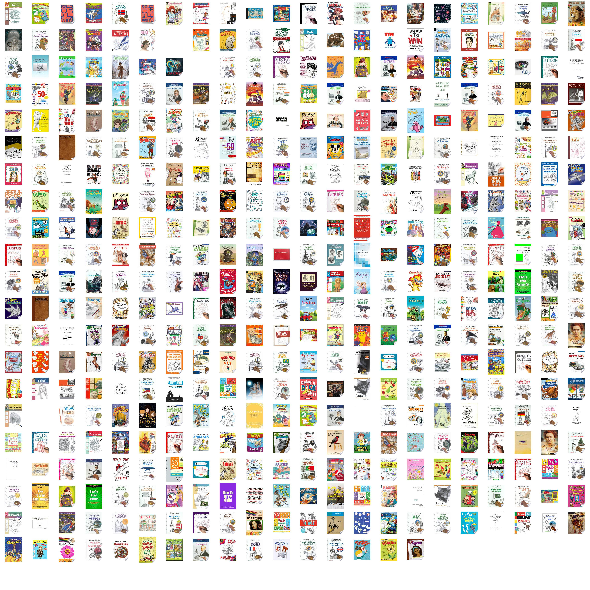

# How to draw

_It's interesting how many books there are providing instructions on how to draw. Wouldn't it be nice to visualise them..._



## What is this

Running main.py does the following:

- Queries the google books API for given keywords.
- Populates files of book images into `images/`.
- Resizes the book images onto a similar size square image and places this new image in `images/resized`.
- Pastes the resized book images into one grid image (eg above) called `./allbooks.jpg`.

## Why

Basically, another creative experiment. I'm interested in 'How to draw' books, and using them in some way to make an original peice of work but not in an instructional way. Looking at them all as one image.

## Running

Create an environment using pipenv then use `pipenv shell` to activate a shell for it. You'll need a google books API key, stick that in a file at `.credentials.py`:

```[python]
key = 'YOURAPIKEY'
```

The API for google books is limited to 1000 per 24h.
In `main.py` add some book keywords and then run `python main.py`

### TODO

- set up to span over 24h, picking up when last run
